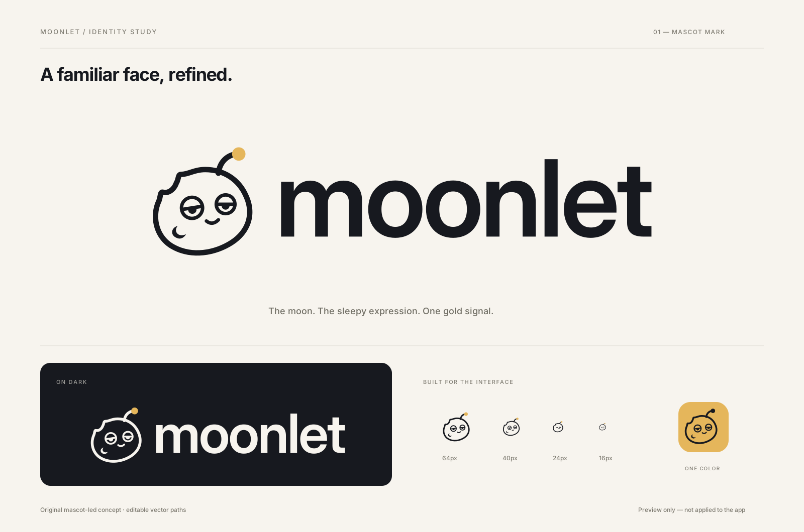

# Approved mascot logo: implementation handoff

This is the approved Moonlet logo artwork. It brings back the mascot's sleepy expression, lunar contour, and gold-tipped antenna. This change adds assets only; the current logo component, favicons, and app UI are unchanged.

## Assets

All SVGs have transparent backgrounds, fixed colors, and no external images, fonts, or scripts. The wordmark is outlined as vector paths, so the lockup does not require a font download.

| Asset | Intended use |
| --- | --- |
| [`mark.svg`](../../public/logo/mascot-v2/mark.svg) | Primary charcoal mascot with a gold antenna tip, for light surfaces. |
| [`mark-reversed.svg`](../../public/logo/mascot-v2/mark-reversed.svg) | Cream mascot with a gold tip, for dark surfaces. |
| [`mark-mono.svg`](../../public/logo/mascot-v2/mark-mono.svg) | Entirely charcoal, for one-color uses such as the gold tile in the preview. |
| [`mark-small.svg`](../../public/logo/mascot-v2/mark-small.svg) | Optical variant for 16–24px: heavier strokes, simplified eyes, and no interior crater. |
| [`lockup.svg`](../../public/logo/mascot-v2/lockup.svg) | Primary mascot and lowercase wordmark together, with approved spacing. |

Next.js serves them at `/logo/mascot-v2/<filename>`. The mark viewBox is `0 0 100 100`; the lockup viewBox is `0 0 382.34 100`. Preserve the aspect ratio and viewBox padding to avoid clipping the antenna or outline.

## Colors

- Charcoal: `#17191f`
- Cream: `#f7f4ee`
- Gold: `#e5b65b`

## Integration notes

- Start with `src/components/logo.tsx`, preserving the existing component interface and accessible naming. Render decorative duplicates with appropriate hidden semantics.
- Use the full mark at 32px and larger, and the small-size variant at 16–24px. The small variant is supplied in the light-surface palette; if inlining it on a dark surface, change only its charcoal strokes to cream and retain the gold tip.
- For a reversed lockup, use the reversed mark and change only the wordmark fill to cream; retain the primary lockup's spacing and proportions.
- The supplied SVGs have no solid face fill: the surface behind the mascot shows through. Use a suitable light, dark, or gold background rather than adding a white box.
- Regenerate favicon and app-icon exports from the approved artwork during integration. Do not use the entire preview board as a logo asset.
- Check the header, sidebar, sign-in screen, public pages, and mobile layouts in both light and dark treatments before shipping the implementation.

The preview is a design reference, not a screenshot of an implemented app. The implementation is intentionally left to the integrating agent.
