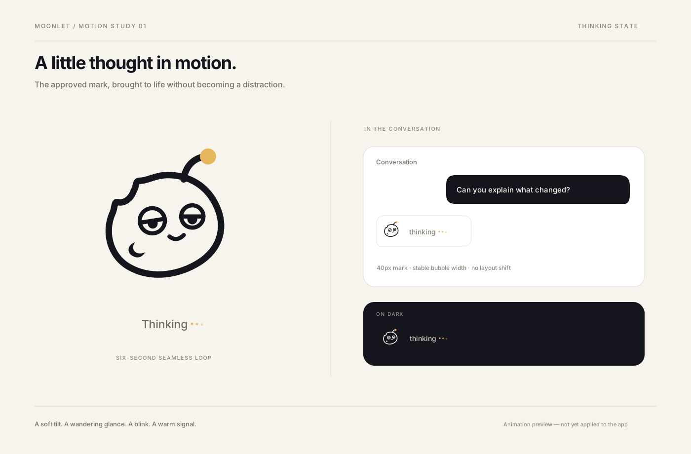

# Approved thinking animation

This is the approved motion treatment for the chat's pending-response state. It uses the approved Moonlet mascot: a gentle head tilt, glancing pupils, two soft blinks, a flexing antenna, and a faint gold pulse. The preview also shows a three-dot indicator next to the status label.

This commit contains artwork, rendering source, and integration guidance only. It does not replace the chat's existing `thinking…` text or change any runtime behavior.



[Watch the approved video](./preview.mp4). The 12-second video shows the same six-second cycle twice, with a large view and 40px light/dark chat examples. The sample conversation is a design mockup, not a recording of an implemented app.

## Files

| File | Purpose |
| --- | --- |
| [`public/logo/mascot-v2/thinking.gif`](../../../public/logo/mascot-v2/thinking.gif) | Approved icon-only animation: 256 × 256, 20fps, six seconds, infinite repeat. |
| [`public/logo/mascot-v2/thinking-still.png`](../../../public/logo/mascot-v2/thinking-still.png) | Matching static first frame for reduced motion or fallback. |
| [`preview.mp4`](./preview.mp4) | H.264/yuv420p video, 1400 × 920, 30fps, 12 seconds, no audio. |
| [`preview.png`](./preview.png) | Static design reference for the video. |
| [`render.py`](./render.py) | Portable vector geometry, motion curves, preview layout, and frame renderer used to produce the approved exports. Not application runtime code. |

The GIF and still have an opaque cream (`#f7f4ee`) background; they are not transparent SVG assets. The video demonstrates how an inline vector version should look on light and dark surfaces. Do not use the full preview video as an in-app loading indicator.

## Implementation handoff

- The intended location is the pending assistant reply in `src/app/app/page.tsx`, where `t.a` is null and the current fallback is `thinking…`. Keep the submitted user message and existing error handling intact.
- Prefer a lightweight inline SVG animated with the app's existing motion library. Use the geometry and `state(t)` function in `render.py` as the source of truth, rather than tracing the GIF or adding a video player to chat.
- The full cycle is six seconds. The head eases from neutral to −5°, then +4°, then neutral, with small pauses. Pupils glance left and right; blinks are centered at 2.25s and 5.19s. The antenna pulse repeats every three seconds; the text-dot wave repeats every two seconds. All motion returns smoothly to its initial state.
- Keep the mark in a fixed 40px box. The render viewBox is `-7 -7 114 114`, which leaves room for the antenna and pulse. Preserve sufficient padding so neither is clipped.
- Keep the bubble and status-label widths stable. Stop and unmount the animation when the response or an error arrives; do not use a page-wide timer or leave the animation running after completion.
- On dark surfaces, recolor the charcoal strokes to cream while retaining the gold (`#e5b65b`) antenna tip. Use transparent vector geometry, not the cream-matte GIF.
- Respect `prefers-reduced-motion` with a static mark and unchanged readable status text. Hide the decorative mark from assistive technology and expose one stable status announcement; do not announce every dot or blink.
- Check normal completion, errors, repeated submissions, restored conversation history, mobile sizing, reduced motion, and light/dark contrast before shipping integration.

## Recreate the exports

The rendering source needs Python 3.10+, CairoSVG 2.9.1, a working Cairo installation, and FFmpeg for video/GIF encoding. The preview board uses the Inter font; install it to match the supplied board's typography. The mascot geometry itself has no font dependency. These are optional asset-authoring tools, not new requirements for running Moonlet.

From the repository root, create an isolated environment and keep generated frames outside the checkout:

```bash
python3 -m venv /tmp/moonlet-motion-venv
/tmp/moonlet-motion-venv/bin/pip install CairoSVG==2.9.1
/tmp/moonlet-motion-venv/bin/python docs/branding/thinking-animation/render.py /tmp/moonlet-thinking-export
cd /tmp/moonlet-thinking-export

ffmpeg -y -framerate 30 -i frames/%03d.png \
  -c:v libx264 -pix_fmt yuv420p -crf 17 -movflags +faststart cycle.mp4
ffmpeg -y -stream_loop 1 -i cycle.mp4 -c copy -movflags +faststart preview.mp4
ffmpeg -y -framerate 30 -i icon-frames/%03d.png \
  -filter_complex "fps=20,split[a][b];[a]palettegen=stats_mode=full[p];[b][p]paletteuse=dither=bayer:bayer_scale=4:diff_mode=rectangle" \
  -loop 0 thinking.gif
cp frames/000.png preview.png
cp icon-frames/000.png thinking-still.png
```

The renderer asserts identical initial and final motion states and writes 180 frames for each view. Do not commit generated frame directories or local dependency environments.
